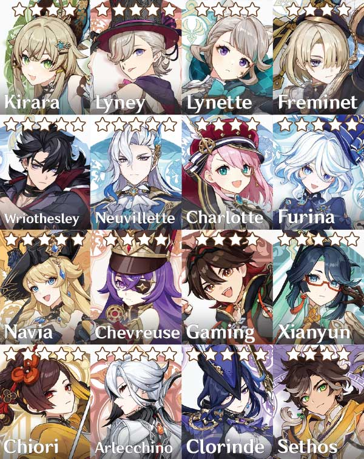
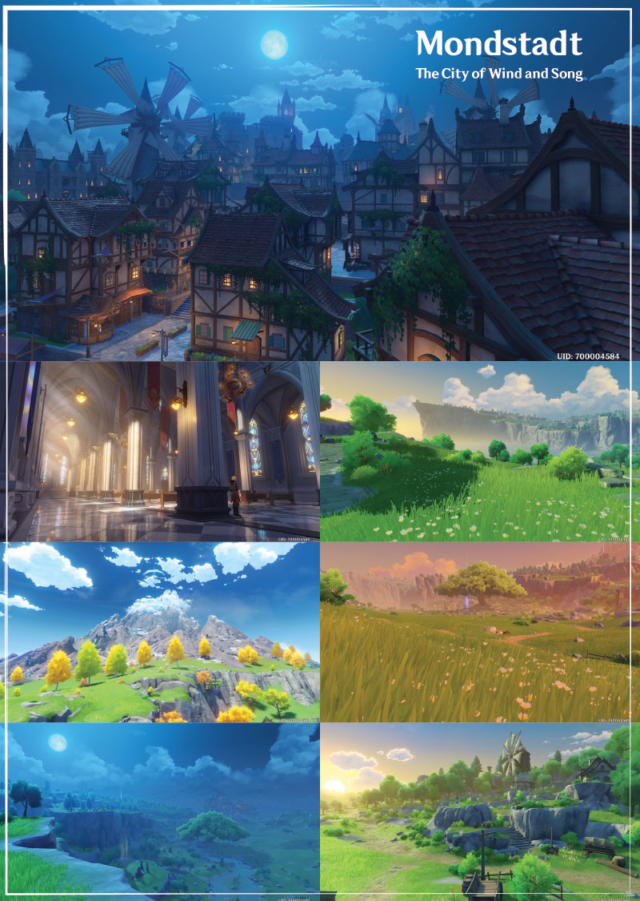

Genshin Impact is a F2P open world action RPG with co-op multiplayer by Chinese developer Hoyoverse, available for PS4, PS5, PC, Android, iOS and Xbox Series X/S.

The Xbox Series X/S version will be releasing on November 20, 2024 as announced by Hoyoverse at gamescom Opening Night Live 2024. Genshin Impact will also be available on Xbox Game Pass service.

A Switch version has also been announced without a specific date as of yet.

Your main character is the Traveler from a far away world. You choose between the twins Lumine (girl) or Aether (boy). The twin you don't pick will still play a major role in the game's story.

You are joined on your journey by a big number of unique characters. These are all the playable characters that have so far been revealed:

With the main character and a team of three other party members you make use of elemental powers and their combination to defeat your enemies. Instead of all party members being present on the combat field at once, and part of them being controlled by the AI, you control all of them. With the press of a button you switch instantly from one character to the other, unleashing devastating combos.

The **Spiral Abyss** and **Imaginarium Theater** provides higher combat difficulty challenges and rewards which resets monthly. The Imaginarium Theater also offers various poses and echoes for select characters as part of the rewards.

There are seven unique open world regions to travel to and to freely explore. These are the six regions that have been released so far:

Exploration and traversal is closely inspired by Breath of the Wild. You will run, climb, glide, swim and since most recently also dive to every nook and cranny of the game world to discover enemy camps, hidden treasures, puzzles, dungeons, bosses and more.

New to Natlan, traveler can transform into various Saurians to navigate the terrains of Natlan.

Genshin Impact is a story driven game. Apart from an extensive main story, many character and world quests bring the world, lore and characters to life. The story is told in many hours of high quality and fully voiced (in English, Japanese, Chinese and Korean) dialogue scenes and cutscenes.

## OST

Featuring a wide variety of beautiful OST by the award-winning composer Yu-Peng Chen and by Western and Eastern producers and orchestras under the credits "HOYO-MiX" that also brought us OSTs for The Lord of the Rings trilogy, Crouching Tiger Hidden Dragon, God of War (2018) and Final Fantasy XV.

<iframe width="560" height="315" src="https://www.youtube.com/embed/0ZNqBF3M7-8?si=Lr8BJdJ7o1abcxpw" title="YouTube video player" frameborder="0" allow="accelerometer; autoplay; clipboard-write; encrypted-media; gyroscope; picture-in-picture; web-share" referrerpolicy="strict-origin-when-cross-origin" allowfullscreen></iframe>

<iframe width="560" height="315" src="https://www.youtube.com/embed/VrP3lO3aGDg?si=2c5aXIIjdr3ed2LJ" title="YouTube video player" frameborder="0" allow="accelerometer; autoplay; clipboard-write; encrypted-media; gyroscope; picture-in-picture; web-share" referrerpolicy="strict-origin-when-cross-origin" allowfullscreen></iframe>

<iframe width="560" height="315" src="https://www.youtube.com/embed/TyCB25oXUA4?si=RcmNK2CwZ_ou-SFU" title="YouTube video player" frameborder="0" allow="accelerometer; autoplay; clipboard-write; encrypted-media; gyroscope; picture-in-picture; web-share" referrerpolicy="strict-origin-when-cross-origin" allowfullscreen></iframe>

## Limited-time story events

Since the release of Genshin Impact back in late 2020, Hoyoverse did not re-run any limited-time story events and the only way to relieve the moments is through Let's Play footage/stream archives.

Generally the patch before the next major varsion features a brand new area for players to explore that is inaccessible after the event ended resulting in newer players missing out such moment:

*<small>Cappet as featured in Summertide Scales and Tales from Version 4.8</small>*

This also means any rewards such as weapons/items that is part of the limited-time story events is no longer acquirable too such as the Cinnabar Spindle, a best in slot 4 stars weapon for Albedo from **Shadows Amidst Snowstorms** event (Nov 25 2021 - Dec 13 2021).

*<small>Cinnabar Spindle in action.</small>*

## Graphical Features

|                 | Dynamic Character Resolution | Global Illumination  | 120fps | Highest Res Textures | Farthest Draw Distance |
| --------------- | ---------------------------- | -------------------- | ------ | -------------------- | ---------------------- |
| PS4             | ✔️                            | ❌                    | ❌      | -                    | -                      |
| PS5/PS5 Pro     | ✔️                            | Always on by default | ❌      | ✔️                    | -                      |
| PC              | ✔️**                          | ✔️**                  | ❌      | -                    | ✔️                      |
| Xbox Series X/S | ✔️                            | ✔️***                 | ❌      | -                    | -                      |
| Android         | ✔️                            | ✔️                    | ❌      | -                    | -                      |
| iOS             | ✔️                            | ✔️                    | ✔️*     | -                    | -                      |

<small>*Currently exclusive to iOS.</small>
<small>**Not available for unsupported graphic cards.</small>
<small>***Series X should be on par with PS5 while Series S is still unknown as of this time of the OT publication.</small>

### Additional Notes
1. **DCR** and **GI** can be toggle in the Graphics settings.
2. PS5 is the only platform with the *highest res* textures.
3. PC with maxed out settings render the *farthest* draw distance.
4. Anti-aliasing options on PC is limited to FSR2 or SMAA.
5. There is render resolution scaling on PC which allows higher than native resolution for supersampling.
6. Borderless window on PC is only available on the display native resolution. Anything lower is Windowed mode only that can be toggle into fullscreen by using **Alt + Enter** shortcut.

**On what platforms is this game available?**

Genshin Impact is available now on PS4, PS5, PC, Android, iOS and Xbox Series X/S on November 20, 2024. A Switch version has also been announced without a specific date as of yet.

**There is no macOS version?**

Officially nope. There is alternative way to run either the PC or iOS on macOS but it is beyond the scope of this OT.

**Is this an MMO?**

No, this is a single-player focused experience with co-op multiplayer to invite a couple of friends over to your game world.

**Do I need to be online all the time?**

Yes, you will need to stay in constant contact with Hoyoverse's servers.

**Does this feature cross play?**

Yes, it does feature cross play on all platforms.

**Does this feature cross save?**

Yes, as of game version 2.0 all platforms' saves will be compatible.

**Is this really F2P? It looks too good to be true.**

Yes, it is F2P. Crazy, right?

**How is this monetized?**

The game is monetized by a character and weapon gacha system.

**Hah, I knew it! Will playing this game in the long run cost me an arm and a leg?**

No, it is very F2P friendly. The gacha system can be mostly ignored, but even by just playing the game you will earn currency to get into some gacha action to with a bit of luck pull some of the additional characters.

**How does the gacha exactly work?**

Playing the game, or purchasing them with money, you obtain a rare currency called primogems. You can exchange this currency in the game shop for Acquaint and Intertwined fates. Those fates are used to pull characters and weapons. Characters are a lot rarer than weapons, there is however a pity system in place in case you have very bad luck pulling characters.

It is also noteworthy that not all characters are obtained just by gacha. Some are obtained by playing the story, by completing game events and some can be obtained by purchasing them in the game shop.

Beginning with 5.0, the ~~scam~~ weapon banner Epitomized Path fate point has been reduced to 1 and a new Capturing Radiance mechanic that increases the chances of winning the 50/50 when pulling for the featured 5-star character limited banners.

**Is this a cheap Breath of the Wild rip-off?**

No. It's openess, world exploration and traversal are closely inspired by BotW, everything else, like its world, its lore, its story, its characters and its combat system are its very own thing. This game's production value is also anything but cheap.

**What exactly are you, Paimon?**

NOT EMERGENCY FOOD!!* Paimon just likes tagging along, guiding the Traveler and helping them out as good as she can while being incredibly adorable.

* Genshin Impact community inside joke. ;)

**Wriothesley re-run when?**

Whenever Hoyoverse melts the frozen jail of Cryo characters.

Story spoilers or leaked content has to be put in spoiler tags. Anyone breaking the rules will spend the rest of their days in Fortress of Meropide at the bottom of the ocean!

**Genshin Impact Scenic Beauty Photography Thread**: https://www.resetera.com/threads/genshin-impacts-incredible-scenic-beauty.424625/

**Genshin Impact Official Site**: https://genshin.hoyoverse.com/en

**Genshin Impact Twitter**: https://twitter.com/GenshinImpact

**Genshin Impact YouTube**: https://www.youtube.com/GenshinImpact

### Special Thanks

Thanks to DatManOvaDer and Dlanor A. Knox for their great gif work. :)

Thanks to **<placeholder_name>** for coming up with the cool topic title. :)

Thanks to ArcticDonkey for coming up with the note on gacha for newcomers. :)

Thanks to Tyaren for creating the previous OTs and the wonderful screenshots of Genshin Impact sceneries.

Genshin Impact is an incredibly fun and rewarding game and is very FTP friendly. All content can be cleared with starting characters and some of the strongest characters are 4*.

It should be noted that the cost of pulling is very high and rates are incredibly low of pulling a 5* character outside of pity. If you're really enjoying the game and don't mind dropping a few bucks, it's generally advised to stick to the $5 Welkin pass or the $10 battle pass.

It can be very tempting to drop money on pulls when posters show off their shiny double off pity 5* pulls, but please be aware that these pulls are extremely rare. Spending real money to chase the hot, new banner character will lead to very real disappointment if they are not in your pity range.

There is no issue spending within your means as long as you're enjoying the game, but be responsible as even spending here and there will really add up over time. If you're considering dropping a large sum of money on pulls for a non-guaranteed 5* here are some general tips:

1) Be prepared to receive nothing for your money. Ask yourself how disappointed you would be.
2) Sleep on it and see if you still want to spend the next day.
3) Set a monthly budget and stick to it.

Now, fun police time over, go do your commissions. :)
